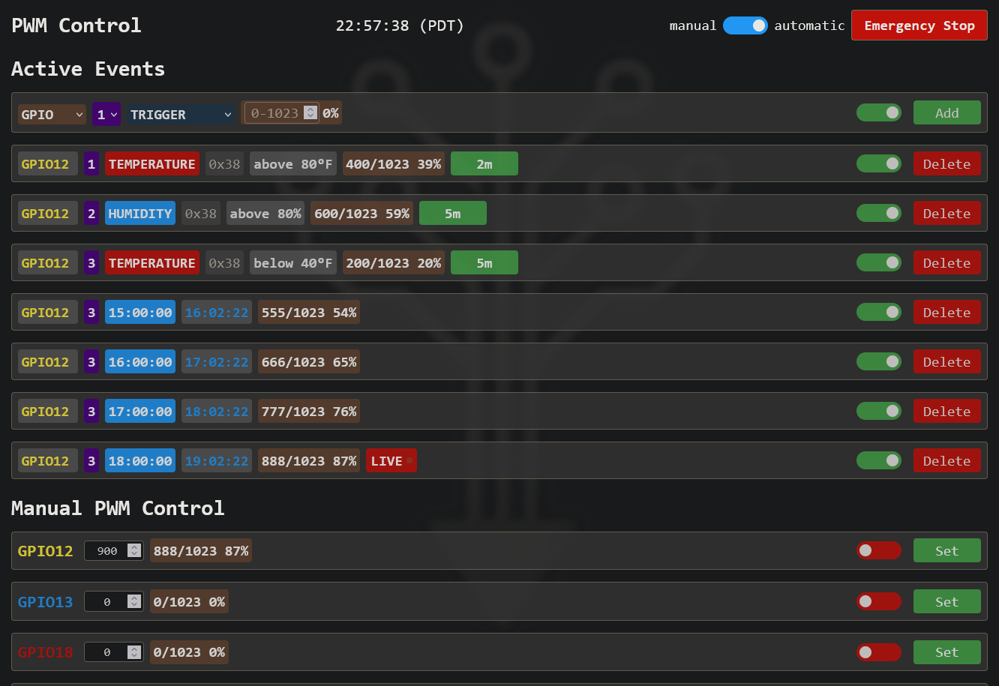
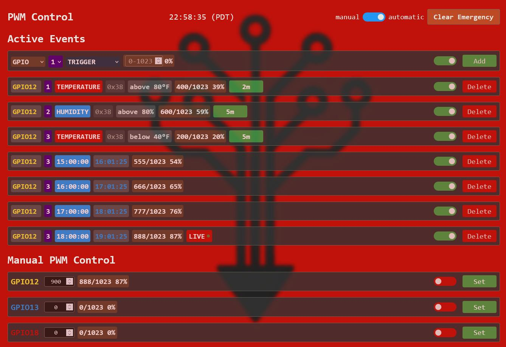
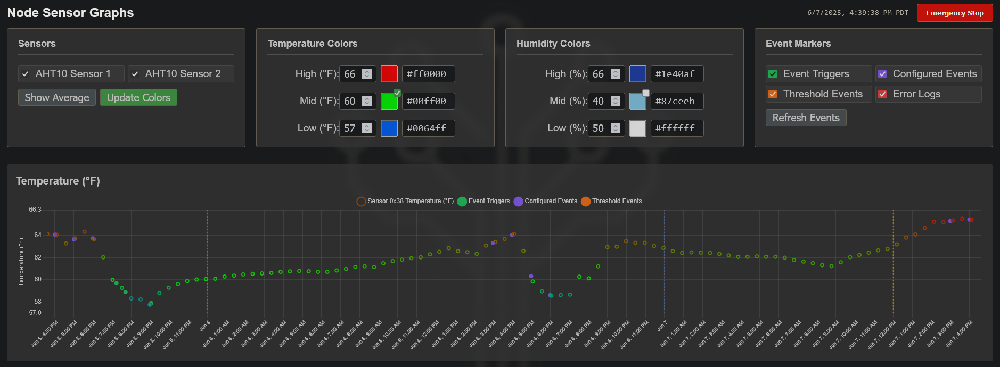
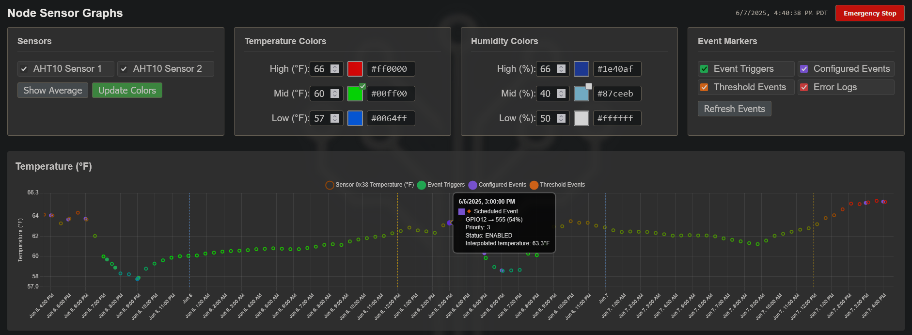

# Undergrowth

Undergrowth turns your Raspberry Pi into a smart environmental controller that actually works out of the box. Monitor temperature and humidity, control fans/pumps with precise PWM, and set up automated responses—all through a clean web interface.

**Why try it?**
- **Just works**: One-script installation handles everything from Node.js to hardware setup
- **Real automation**: Set time schedules OR threshold triggers (temp too high? fans auto-start)
- **Beautiful graphs**: See your data with color-coded sensor readings and event markers
- **Network ready**: MQTT support for multi-node setups and remote monitoring
- **Safety first**: Emergency stops and fail-safes protect your equipment

Perfect for greenhouses, grow rooms, lab equipment, or anywhere you need reliable environmental control without the complexity of industrial systems.

## Screenshots

### Scheduling Interface


The scheduling interface allows you to set up automated responses based on time or environmental conditions.

### Emergency Mode


When emergency mode is activated, the GUI provides immediate access to critical controls and system status.

### Multi-Sensor Graphing


The graph view shows data from multiple sensors with configurable colors. Alerts and messages are also displayed on the timeline for complete system visibility.

### Detailed Event Data


Hover over any event in the graph to see detailed data and notes, making it easy to track system behavior over time.

## Installation

### What You'll Need
- Raspberry Pi (Zero W, 3, or 4 recommended)
- MicroSD card (16GB minimum, 32GB recommended)
- AHT10 or AHT20 temperature/humidity sensor
- Jumper wires for sensor connection
- Optional: Monitor and keyboard for initial setup

### Step 1: Prepare the SD Card

1. **Download Etcher**: Get the SD card flashing tool from [etcher.balena.io](https://etcher.balena.io/#download-etcher)

2. **Download DietPi**: Download the latest DietPi image from [dietpi.com](https://dietpi.com/downloads/images/DietPi_RPi234-ARMv8-Bookworm.img.xz)

3. **Flash the image**: 
   - Open Etcher
   - Select the DietPi image file
   - Select your SD card
   - Click "Flash!"

### Step 2: Configure WiFi and Automation

1. **Insert the SD card** back into your computer after flashing

2. **Configure WiFi**: Edit the `dietpi-wifi.txt` file on the SD card:
   ```
   aWIFI_SSID[0]='YourWiFiName'
   aWIFI_KEY[0]='YourWiFiPassword'
   ```

3. **Copy configuration files**: 
   - Download the config files from the [dietpi/v1.2 (stable hybrid)](https://github.com/colepurbaugh/undergrowth-node/tree/main/dietpi/v1.2%20(stable%20hybrid)) folder in this repository
   - Copy `Automation_Custom_Script.sh`, `config.txt`, and `dietpi.txt` to the root of your SD card
   - **Important**: Edit the WiFi credentials in `dietpi-wifi.txt` to match your network

4. **Double-check your WiFi settings** - this is critical for the automated installation to work

### Step 3: Boot and Install

1. **Insert SD card** into your Raspberry Pi
2. **Connect monitor and keyboard** (optional but recommended for first boot)
3. **Power on** the Pi
4. **Wait for automatic installation** - this takes 15-20 minutes and includes:
   - System updates
   - Node.js installation
   - Hardware configuration
   - Undergrowth software download and setup
   - Automatic reboot

The Pi will automatically reboot when installation is complete.

### Step 4: Wire the AHT10/AHT20 Sensor

Connect your temperature/humidity sensor to the Raspberry Pi GPIO pins:

```
AHT10/20 Sensor → Raspberry Pi
─────────────────────────────
VCC (3.3V)      → Pin 1  (3.3V)
SDA             → Pin 3  (GPIO 2 - SDA)
SCL             → Pin 5  (GPIO 3 - SCL)
GND             → Pin 9  (Ground)
```

### Step 5: Access the Web Interface

1. **Find your Pi's IP address** (check your router's connected devices)
2. **Open a web browser** and navigate to `http://[PI_IP_ADDRESS]`
3. **Start monitoring!** You should see live temperature and humidity readings

Your Undergrowth system is now ready to use!
